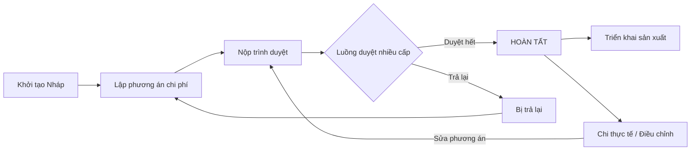
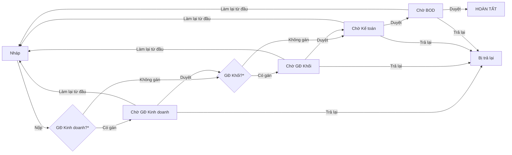
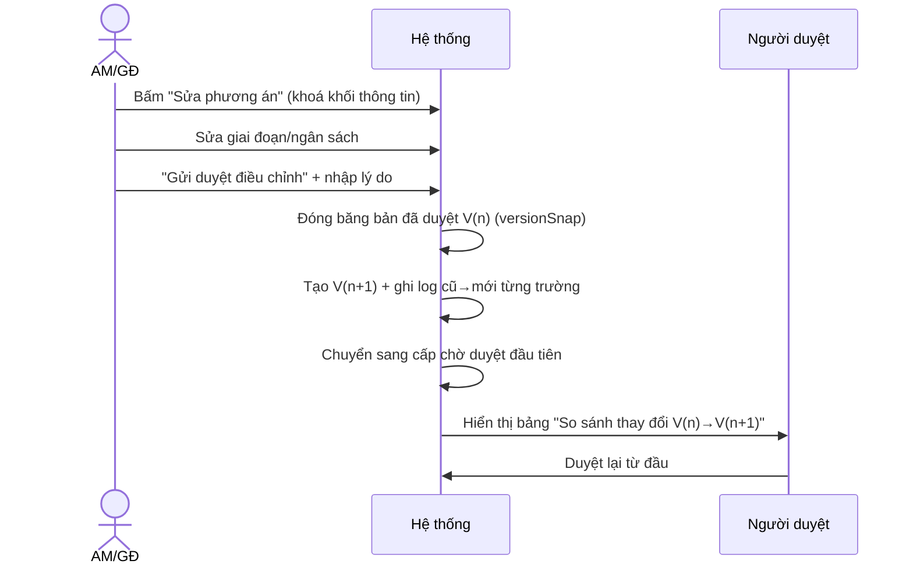

# MÔ TẢ CHI TIẾT LUỒNG CHỨC NĂNG NGHIỆP VỤ
## Module PLM — Quản lý Phương án Kinh doanh & Dự án đấu thầu (IMIS)

> Tài liệu mô tả từng luồng nghiệp vụ end-to-end: tác nhân, tiền điều kiện, các bước thao tác trên giao diện, hành vi hệ thống, trạng thái, quy tắc và ngoại lệ. Bám sát mã nguồn (`projectTypes.ts`, `projectWorkflow.ts`, `ProjectsPage.tsx`) và giao diện hiện hành.
>
> Phiên bản: 1.0 · Ngày: 2026-07-16

---

## 0. Tổng quan & Ký hiệu

**Thực thể trung tâm:** `PAKD` (Phương án Kinh doanh) — mỗi PAKD ứng với một cơ hội/gói thầu, gồm 6 giai đoạn chuẩn **KH01–KH06** và các mã dự án.

**Vai trò tham gia:**
| Ký hiệu | Vai trò | Vai trò nghiệp vụ |
|---|---|---|
| AM | SALE | Account Manager — người lập PAKD |
| GĐKD | SALES_DIRECTOR | Giám đốc Kinh doanh |
| GĐK | BUSINESS_DIRECTOR | Giám đốc Khối |
| KT | ACCOUNTANT | Kế toán |
| BOD | BOD | Ban Giám đốc |
| SX | PRODUCTION | Khối Sản xuất |
| IT | IT | Bộ phận IT |
| ADM | ADMIN | Quản trị hệ thống |

**Sơ đồ vòng đời tổng quát:**


---

## 1. LUỒNG: Đăng nhập & Phân quyền

**Mục đích:** Xác định vai trò để hiển thị đúng chức năng.

**Các bước:**
1. Người dùng mở ứng dụng → màn **Đăng nhập** ("IMIS — Quản lý PAKD").
2. Nhập tài khoản (username) + mật khẩu, hoặc bấm chọn nhanh 1 **tài khoản demo** (AM, GĐKD, GĐK, BOD, KT…).
3. Hệ thống lưu phiên vào `localStorage` (`plm_user`) và tải giao diện theo vai trò.

**Hành vi hệ thống theo vai trò:**
- Nút **"Tạo dự án"**: chỉ AM / GĐKD / GĐK.
- Tab **"Dashboard BOD"**: BOD / ADM. Tab **"Dashboard GĐ Khối"**: GĐK / ADM.
- Tab **"Import PAKD"**: AM / GĐKD / GĐK / ADM.
- Thao tác tab **"Chi thực tế"**: KT / ADM.
- Hàng đợi duyệt hiển thị hồ sơ đúng cấp của vai trò hiện tại.

**Đăng xuất:** xoá phiên, quay lại màn đăng nhập.

---

## 2. LUỒNG: Quản lý Khách hàng / Chủ đầu tư

**Mục đích:** Chuẩn hoá danh mục khách hàng làm gốc sinh mã dự án.

**Các bước:**
1. Vào tab **"Khách hàng"**.
2. Xem danh mục (Mã KH, Tên, MST, người liên hệ, domain…).
3. (AM/GĐ/ADM) **Thêm/Sửa** khách hàng.

**Quy tắc:** Mã khách hàng (vd `KH0001`, `VTX`) là **tiền tố** để sinh Mã tổng dự án. Khi Import PAKD, khách hàng chưa có sẽ được **tạo mới tự động**.

---

## 3. LUỒNG: Khởi tạo PAKD (inline, không popup)

**Tác nhân:** AM (hoặc GĐKD/GĐK). **Tiền điều kiện:** đã đăng nhập vai trò được phép.

**Các bước:**
1. Bấm **"Tạo dự án"** → hệ thống **tạo ngay 1 PAKD trạng thái Nháp** và **mở thẳng màn thông tin chi tiết** (không hiện popup).
2. Hệ thống sinh sẵn **Mã tổng mặc định `022.xxx`** + Mã kinh doanh `.1` + Mã sản xuất `.2`; khởi tạo **6 giai đoạn KH01–KH06**.
3. AM nhập tại **khối Thông tin cơ hội kinh doanh**: Mã/Tên khách hàng, Domain, PM, Tiến độ (từ–đến).
4. AM nhập **khối Tài chính**: Doanh thu dự kiến, Chi phí dự kiến → hệ thống tự tính **Lợi nhuận gộp dự kiến (%)**.
5. (Tuỳ chọn) bấm **"Sinh lại mã theo mã KH"** để sinh Mã tổng theo mã khách hàng vừa nhập (chỉ khi còn Nháp).
6. AM lập phương án chi phí (Luồng 5) rồi **"Nộp trình duyệt"** (Luồng 6).

**Kết quả:** PAKD Nháp xuất hiện đầu **Danh sách PAKD** và trong **"Đơn của tôi"**.

---

## 4. LUỒNG: Sinh & Quản lý Mã dự án

**Cấu trúc mã:**
```
Mã tổng       = <Mã KH>.<3 số>        (vd 022.689)
Mã kinh doanh = <Mã tổng>.1           (022.689.1)
Mã sản xuất   = <Mã tổng>.2           (022.689.2)
Mã outsource  = <Mã sản xuất>.n       (022.689.2.1, .2.2 …)
```

**Các bước liên quan:**
1. Mã tổng/KD/SX sinh **tự động khi tạo dự án**; hiển thị dạng **lưới 3 thẻ** kèm PM từng mã.
2. **"Cập nhật PM"**: gán PM cho mã kinh doanh / mã sản xuất.
3. **"Mở mã outsource"** (AM/GĐ): nhập nội dung thuê ngoài → hệ thống sinh mã con của mã sản xuất.
4. **"Sinh lại mã theo mã KH"** (khi Nháp): sinh lại Mã tổng theo mã khách hàng đang nhập.

**Quy tắc:** một số hậu tố mã bị loại trừ theo quy ước nội bộ khi sinh ngẫu nhiên.

---

## 5. LUỒNG: Lập phương án chi phí theo giai đoạn

**Tác nhân:** AM (khi Nháp/Bị trả lại). **Màn hình:** tab "Phương án kinh doanh (KH01–KH06)".

**6 giai đoạn chuẩn:** Hình thành cơ hội → Khảo sát, lập kế hoạch → Lựa chọn nhà thầu → Tổ chức lựa chọn nhà thầu → Ký hợp đồng → Đóng dự án, Kiểm toán.

**Các bước (bảng lưới):**
1. Với mỗi giai đoạn: nhập **Bắt đầu, Kết thúc, Mục tiêu, Kết quả đầu ra**.
2. Nhập **Ngân sách phân bổ**: cột **Sản xuất** và **Kinh doanh**; cột **Tổng** tự cộng; hàng **Tổng** cuối bảng tự cộng toàn dự án.
3. (Tuỳ chọn) **Đính kèm tài liệu** cho từng giai đoạn.
4. **Thêm/Xoá giai đoạn** (KH07…), **đổi tên giai đoạn**.
5. Đặt **"giai đoạn hiện tại"**; khi xong bấm **"Hoàn thành, chuyển giai đoạn sau"**.

**Quy tắc/Ngoại lệ:**
- Khi đang ở **KH02**, không cho chuyển giai đoạn nếu **chưa nhập đủ Thông tin dự án sản xuất** (PM, ngày bắt đầu/kết thúc).
- Sau khi vào bước Kế toán (đã qua duyệt), **bảng chi phí bị khoá** — muốn sửa phải qua luồng điều chỉnh.

---

## 6. LUỒNG: Nộp & Phê duyệt nhiều cấp (luồng động)

**Sơ đồ luồng duyệt:**

`*` Cấp GĐ chỉ có hiệu lực nếu PAKD được gán người phụ trách; nếu không, hệ thống **tự bỏ qua**.

**Các bước:**
1. AM bấm **"Nộp trình duyệt"** → hệ thống xác định **cấp chờ duyệt đầu tiên** (bỏ qua GĐ không gán) và ghi mốc "Người lập nộp trình duyệt" vào **lịch sử phê duyệt**.
2. Nếu nộp thẳng vào **Kế toán** (bỏ qua cả 2 cấp GĐ) → hệ thống **khoá bảng chi phí** và (nếu chưa có) **sinh mã dự án**.
3. Ở mỗi cấp, người duyệt (đúng vai trò) vào **"Hàng đợi duyệt"** hoặc mở chi tiết PAKD:
   - **Duyệt** (kèm ý kiến) → chuyển **cấp kế tiếp** (bỏ qua GĐ không gán); BOD duyệt → **Hoàn tất**.
   - **Trả lại** → trạng thái **Bị trả lại**, AM chỉnh & nộp lại.
   - **Làm lại từ đầu (Restart)** → trả về người lập, duyệt lại từ bước đầu.
4. Mọi quyết định ghi vào **lịch sử phê duyệt** (actor, vai trò, hành động, ý kiến, thời gian) và **Nhật ký hệ thống**.

**Hiển thị hỗ trợ:** "Trạng thái đơn", "Người duyệt tiếp theo", thanh phê duyệt bật khi tới lượt vai trò hiện tại, chuông thông báo số hồ sơ chờ.

---

## 7. LUỒNG: Chỉnh sửa Thông tin dự án (lưu trực tiếp, KHÔNG duyệt)

**Tác nhân:** AM/GĐKD/GĐK trên PAKD đã **Hoàn tất**.

**Các bước:**
1. Bấm **"Chỉnh sửa thông tin"** → **chỉ khối thông tin phía trên** mở để sửa (khách hàng, PM, domain, tiến độ, tài chính). Phần **phương án kinh doanh bị khoá**.
2. Sửa các trường → **lưu trực tiếp ngay** (banner xanh xác nhận "lưu trực tiếp, không cần trình duyệt").
3. Bấm **"Xong (đã lưu thông tin)"** để thoát.

**Quy tắc:** thay đổi thông tin **không sinh phiên bản**, **không đưa vào luồng duyệt**.

---

## 8. LUỒNG: Sửa Phương án kinh doanh (tạo phiên bản mới + duyệt lại)

**Tác nhân:** AM/GĐKD/GĐK trên PAKD **Hoàn tất** (hoặc phiếu bị trả lại đã khoá).

**Sơ đồ:**


**Các bước:**
1. Bấm **"Sửa phương án"** → chỉ phần **giai đoạn & ngân sách** mở sửa; thông tin phía trên **khoá**; banner cam nhắc quy trình.
2. Sửa xong bấm **"Gửi duyệt điều chỉnh kế hoạch & ngân sách"** → nhập **lý do (bắt buộc)**.
3. Hệ thống:
   - **Đóng băng** bản đang hiện hành thành **V(n) đã chốt** (xem lại read-only qua chip phiên bản);
   - Tạo **V(n+1)** với số liệu mới; ghi **log cũ → mới** cho từng trường thay đổi (tên/thời gian/mục tiêu/kết quả/NS Kinh doanh/NS Sản xuất);
   - Đặt trạng thái về **cấp chờ duyệt đầu tiên** (trình duyệt lại từ đầu); lưu lý do vào `pendingAdjustReason`.
4. **Người duyệt** khi mở PAKD thấy ngay **bảng "So sánh thay đổi so với bản đã duyệt (V cũ → V mới)"**: Giai đoạn • Nội dung • Bản cũ (gạch đỏ) • Bản mới (xanh) — để nắm rõ thay đổi trước khi duyệt.
5. "Thoát sửa phương án" (khi chưa gửi) hoàn tác phần kế hoạch; thông tin đã sửa vẫn giữ.

**Quy tắc:** Bản đã duyệt (V trước) **luôn được giữ nguyên**; mỗi lần gửi duyệt điều chỉnh là **một phiên bản mới**. Đơn bị trả lại nộp lại thì **giữ nguyên số phiên bản**.

---

## 9. LUỒNG: Phiếu điều chỉnh Chi phí (Change Request)

**Mục đích:** thay đổi khoản chi (thêm/sửa/xoá) sau khi đã chốt, có luồng duyệt riêng.

**Các bước:**
1. Tạo **phiếu điều chỉnh chi phí**: chọn thao tác ADD/EDIT/DELETE cho từng khoản, nhập **lý do**.
2. Luồng duyệt: **GĐ Khối → Kế toán → BOD**.
3. Khi duyệt xong → **áp dụng** thay đổi vào chi phí; ghi ảnh chụp phiên bản (tổng CP trước → sau).
4. Theo dõi qua tab **"Phiếu điều chỉnh CP"** (hàng đợi theo vai trò) và mục phiếu trong chi tiết PAKD.

---

## 10. LUỒNG: Phiếu điều chỉnh Ngân sách giai đoạn (Budget Adjustment)

**Mục đích:** đổi ngân sách Kinh doanh/Sản xuất của **một giai đoạn**.

**Các bước:**
1. Tại giai đoạn → mở **Lịch sử NS** → tạo đề nghị: ngân sách **trước → sau** + **lý do**.
2. Luồng duyệt: **GĐ Khối → Kế toán → BOD** (mỗi cấp Duyệt/Từ chối).
3. Được duyệt → cập nhật ngân sách giai đoạn; lưu lịch sử điều chỉnh ngân sách của giai đoạn.

---

## 11. LUỒNG: Chi thực tế (Kế toán import & đối chiếu)

**Tác nhân:** Kế toán/ADM. **Màn hình:** tab "Chi thực tế (Kế toán)".

**Các bước:**
1. Chuẩn bị file **4 cột**: `Mã dự án • Chi sản xuất • Chi kinh doanh • Ngày update` (có nút **tải file mẫu**).
2. **Chọn file CSV** hoặc dán dữ liệu → hệ thống **xem trước**, khớp mã dự án theo **Mã tổng / Mã PAKD / Mã KD / Mã SX**.
3. Bấm **"Áp dụng"** → chi thực tế được **cộng dồn** theo dự án; bỏ qua dòng không khớp.
4. **Bảng tổng hợp** chi thực tế theo dự án; đối chiếu với ngân sách → tính **% đã chi**.

**Quy tắc:** mỗi tháng import một lần; hệ thống cộng dồn theo dự án. Chi thực tế là nguồn tính **cảnh báo vượt ngân sách** ở dashboard.

---

## 12. LUỒNG: Triển khai Sản xuất

**Tác nhân:** GĐ Khối (thông tin dự án SX) + Khối Sản xuất (đầu việc). **Điều kiện:** PAKD đã qua duyệt Kế toán (Chờ BOD/IT/Hoàn tất).

**Các bước:**
1. Tab **"Sản xuất — Triển khai"**, chọn giai đoạn.
2. GĐ Khối nhập **Thông tin dự án sản xuất**: Work order, loại dự án, ưu tiên, quy mô, phòng ban, PM, domain, khách hàng, thời gian, trạng thái.
3. Khối SX **thêm đầu việc triển khai**: tên, người phụ trách, thời gian, **tiến độ %** → hệ thống tự ghi **ngày cập nhật**.
4. Khi hoàn thành giai đoạn → chuyển giai đoạn kế tiếp.

---

## 13. LUỒNG: Import hàng loạt

### 13.1. Import PAKD (tạo nhiều dự án)
1. Tab **"Import PAKD"** → chế độ **"Tạo PAKD mới"**.
2. Chọn file Excel theo mẫu **`MAU_IMPORT_DU_AN.xlsx`** (sheet `Import_DuAn`).
3. Chọn **trạng thái sau import** (Hoàn tất / Nháp).
4. Hệ thống **xem trước**: số dòng hợp lệ / lỗi / khách hàng mới; cột bắt buộc **Tên dự án, Mã khách hàng**.
5. Bấm **Import** → tạo hàng loạt PAKD; **tự tạo khách hàng mới** cho mã chưa có.

### 13.2. Import Ngân sách giai đoạn
1. Chế độ **"Ngân sách giai đoạn"** (long-format: mỗi dòng = 1 giai đoạn của 1 dự án).
2. Khớp dự án theo **Mã tổng/PAKD/KD/SX**; xem trước cách xử lý từng dự án.
3. Dự án **Nháp** → cập nhật trực tiếp; dự án **đã chốt/đang duyệt** → **tạo phiên bản mới & trình duyệt lại** (bắt buộc nhập **lý do**).
4. Hỗ trợ `.xlsx` và `.csv` (UTF-8).

---

## 14. LUỒNG: Dashboard hỗ trợ ra quyết định

### 14.1. Dashboard BOD (toàn danh mục)
Danh sách **cảnh báo** theo mức độ (đỏ/cam/xanh): vượt tổng ngân sách; vượt theo loại SX/KD; sắp chạm trần (≥85%); **biên LN < 15%**; chi vượt chi phí dự kiến; giai đoạn quá hạn; đơn bị trả; đang điều chỉnh chờ duyệt. Bấm cảnh báo → mở PAKD.

### 14.2. Dashboard GĐ Khối (lọc theo khối)
- **6 KPI:** số dự án khối (đang chạy) · tổng giá trị HĐ · LN gộp dự kiến + biên TB · đã chi/kế hoạch (%) · số chờ tôi duyệt · số dự án rủi ro.
- **Bảng hành động:** Hàng đợi chờ tôi duyệt (kèm **tuổi hồ sơ**) · Biên LN thấp nhất · Ngân sách vs Thực chi · Tải công việc theo PM · Cơ cấu theo Domain.
- Mọi dòng bấm mở chi tiết dự án.

---

## 15. LUỒNG: Nhật ký hệ thống (Audit)

Mọi hành động quan trọng (nộp, duyệt, trả lại, làm lại, điều chỉnh, import, cập nhật chi) được ghi vào **Nhật ký hệ thống**: người thực hiện, vai trò, hành động, trạng thái cũ → mới, thời gian, ghi chú. Xem tại tab **"Nhật ký hệ thống"**.

---

## 16. Bảng tổng hợp trạng thái & hành động

| Trạng thái | Ai thao tác | Hành động chính | Kết quả |
|---|---|---|---|
| Nháp | AM | Lập phương án, Nộp trình duyệt | → Cấp chờ duyệt đầu tiên |
| Chờ GĐ Kinh doanh | GĐKD | Duyệt/Trả lại/Làm lại | → GĐ Khối / Bị trả lại / Nháp |
| Chờ GĐ Khối | GĐK | Duyệt/Trả lại/Làm lại | → Kế toán / Bị trả lại / Nháp |
| Chờ Kế toán | KT | Duyệt/Trả lại/Làm lại (khoá chi phí) | → BOD / Bị trả lại / Nháp |
| Chờ BOD | BOD | Duyệt/Trả lại/Làm lại | → Hoàn tất / Bị trả lại / Nháp |
| Hoàn tất | AM/GĐ, KT, SX | Chỉnh sửa thông tin (trực tiếp) · Sửa phương án (→V+1) · Import chi thực tế · Triển khai SX | Cập nhật / Trình duyệt lại |
| Bị trả lại | AM | Chỉnh sửa & nộp lại | → Cấp chờ duyệt đầu tiên (giữ phiên bản) |

---

## 17. Ma trận Vai trò × Luồng (rút gọn)

| Luồng | AM | GĐKD | GĐK | KT | BOD | SX | ADM |
|---|---|---|---|---|---|---|---|
| Tạo/Lập phương án | ✔ | ✔ | ✔ | | | | ✔ |
| Nộp trình duyệt | ✔ | ✔ | ✔ | | | | ✔ |
| Duyệt theo cấp | | ✔ | ✔ | ✔ | ✔ | | ✔ |
| Chỉnh sửa thông tin | ✔ | ✔ | ✔ | | | | ✔ |
| Sửa phương án (→duyệt lại) | ✔ | ✔ | ✔ | | | | ✔ |
| Phiếu điều chỉnh CP/NS | ✔(tạo) | ✔ | ✔ | ✔ | ✔ | | ✔ |
| Import chi thực tế | | | | ✔ | | | ✔ |
| Triển khai sản xuất | | | ✔ | | | ✔ | ✔ |
| Import hàng loạt | ✔ | ✔ | ✔ | | | | ✔ |
| Dashboard BOD | | | | | ✔ | | ✔ |
| Dashboard GĐ Khối | | | ✔ | | | | ✔ |

---

*Tài liệu tham chiếu: BRD.md, SRS.md, ERD.md, DACTA-USECASE-PAKD.md, TESTCASES-PAKD.md, HDSD (*.docx).*
